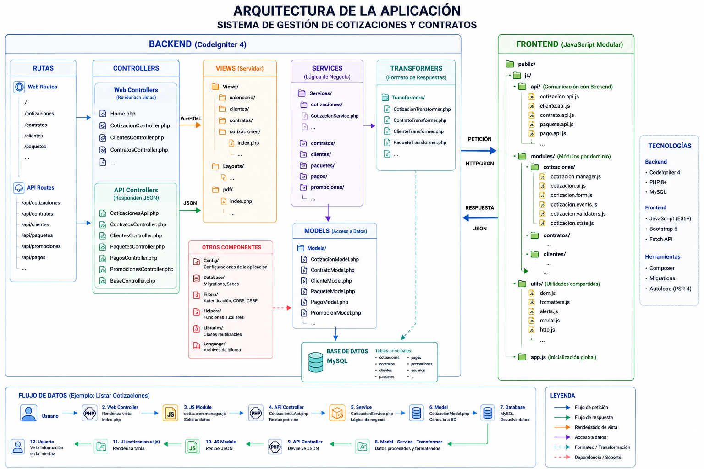

# Sistema de Gestión de Cotizaciones y Contratos
Aplicación web desarrollada para la empresa Ronceros orientada a la gestión de cotizaciones, contratos y optimización del flujo de trabajo empresarial.

## Tecnologias
- PHP 8.2
- CodeIgniter 4
- MySQL
- Composer

## Características
- Gestión de cotizaciones
- Gestión de contratos
- API REST
- Modular JS frontend

## Arquitectura de la Aplicación


La aplicación sigue una arquitectura basada en capas:

- `Controllers`: reciben y validan peticiones.
- `Services`: contienen la lógica de negocio.
- `Models`: acceso y manipulación de datos.
- `Transformers`: formatean respuestas JSON.
- `Frontend modular`: organizado por dominios funcionales.

## Instalación
1. Clonar el repositorio
```
git clone https://github.com/danielayala-06/Proyecto-de-Innovacion.git
```
2. Instalar dependencias
```
composer install
```
3. Configurar `.env`
```dotenv
#--------------------------------------------------------------------
# ENVIRONMENT
#--------------------------------------------------------------------

# CI_ENVIRONMENT = production

#--------------------------------------------------------------------
# DATABASE
#--------------------------------------------------------------------

# database.default.hostname = localhost
# database.default.database = database_name
# database.default.username = user_name
# database.default.password = 
# database.default.DBDriver = MySQLi
# database.default.DBPrefix =
# database.default.port = 3306
```
5. Crear la base de datos en MySQL
En tu gestor de base datos MySQL preferido crea una bd con el nombre de la bd que configuraste en tu archivo `.env`
6. Ejecutar migraciones
```bash
php spark migrate
```
7. Ejecutar semillas
```bash
php spark db:seed DatabaseSeeder
```
8. Ejecutar aplicación
```bash
php spark serve
```

## Estructura del proyecto
```
├───app
│   ├───Config
│   ├───Controllers
│   │   └───Api
│   ├───Database
│   │   ├───Migrations
│   │   └───Seeds
│   ├───Filters
│   ├───Helpers
│   ├───Libraries
│   ├───Models
│   ├───Services
│   │   └───cotizaciones
│   ├───ThirdParty
│   ├───Transformers
│   └───Views
│       ├───calendario
│       ├───clientes
│       ├───contratos
│       ├───cotizaciones
│       ├───errors
│       │   ├───cli
│       │   └───html
│       ├───Layouts
│       ├───paquetes
│       └───pdf
│           └───reportes
├───public
│   ├───css
│   └───js
│       ├───api
│       ├───modules
│       │   └───cotizaciones
│       └───utils
├───tests
│   ├───database
│   ├───session
│   ├───unit
│   └───_support
│       ├───Database
│       │   ├───Migrations
│       │   └───Seeds
│       ├───Libraries
│       └───Models
├───vendor
└───writable
```

